# ESPHome Intercom
From a simple ESPHome full-duplex doorbell to a PBX-like multi-device intercom, all the way to a complete Voice Assistant experience, with wake word detection, echo cancellation, LVGL touchscreen UI, intercom, and ready-to-flash configs for tested ESP32 hardware.

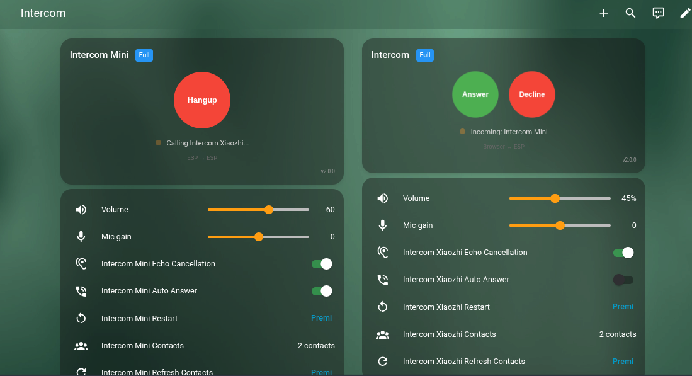

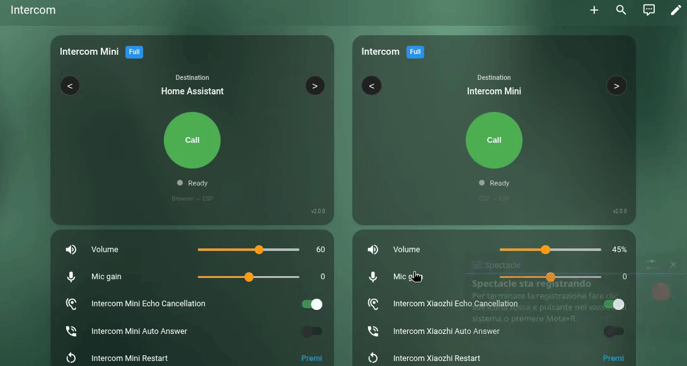

<table>
  <tr>
    <td align="center">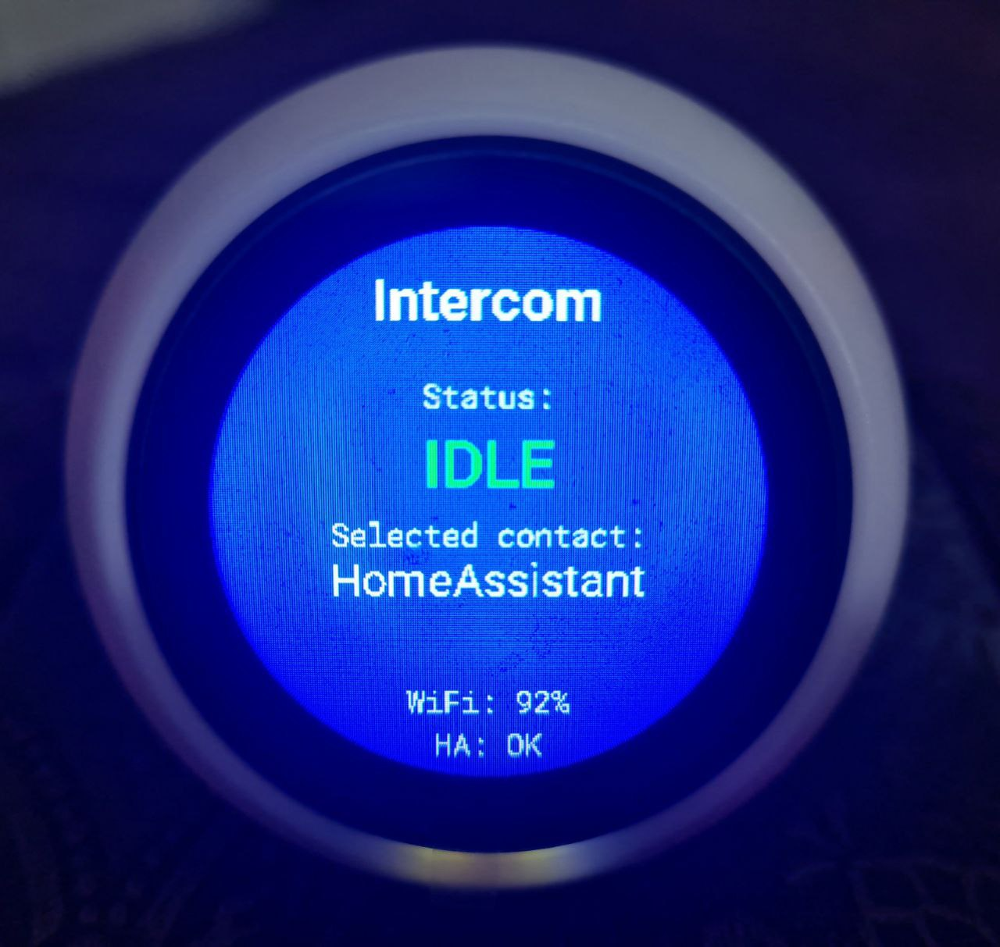<br/><b>Idle</b></td>
    <td align="center">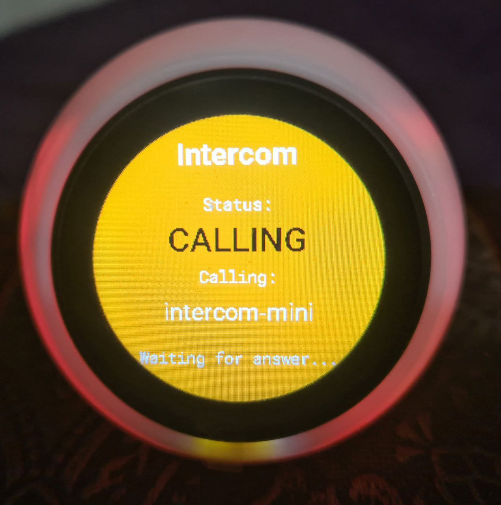<br/><b>Calling</b></td>
    <td align="center">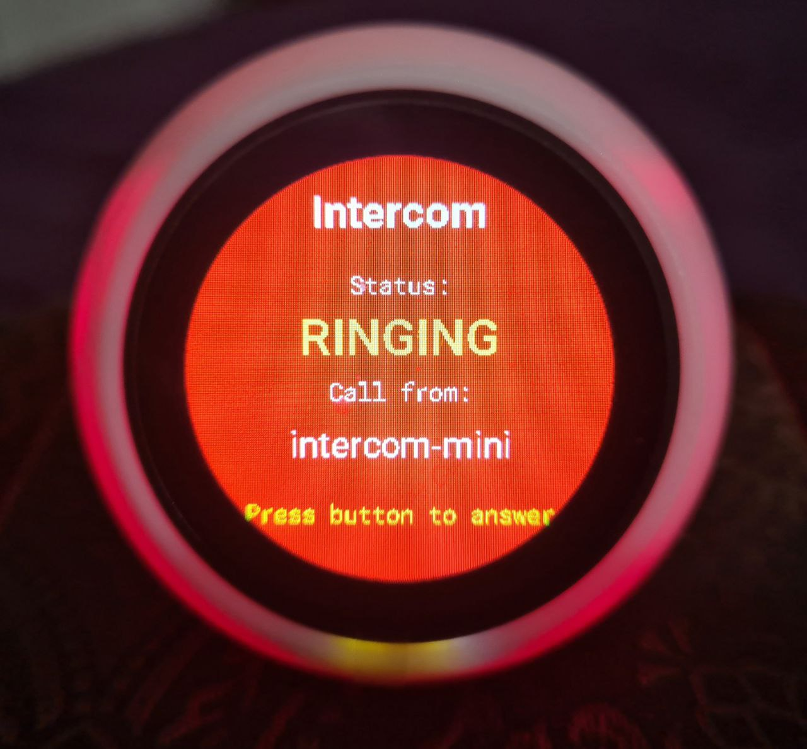<br/><b>Ringing</b></td>
    <td align="center">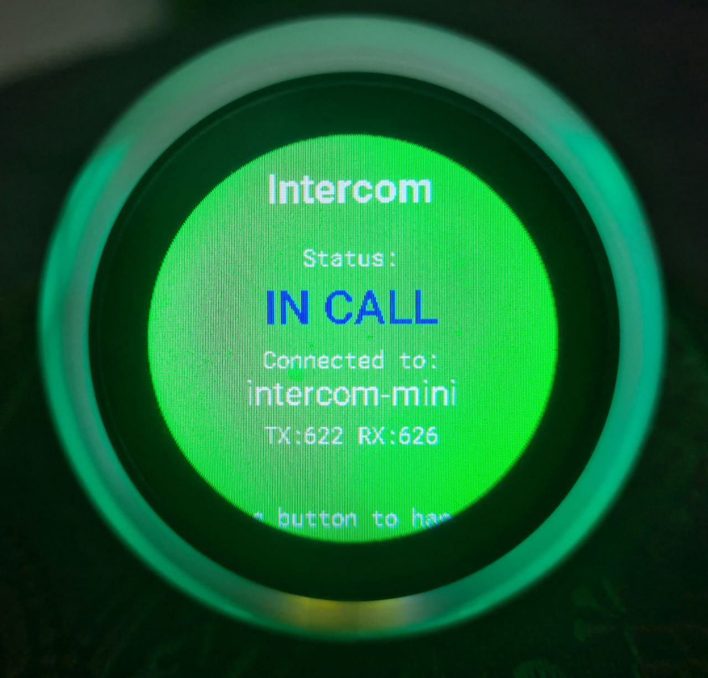<br/><b>In Call</b></td>
  </tr>
</table>

## Table of Contents

- [Overview](#overview)
- [Features](#features)
- [Architecture](#architecture)
- [Installation](#installation)
  - [1. Home Assistant Integration](#1-home-assistant-integration)
  - [2. ESPHome Component](#2-esphome-component)
  - [3. Lovelace Card](#3-lovelace-card)
- [Operating Modes](#operating-modes)
  - [Simple Mode](#simple-mode-browser--esp)
  - [Full Mode](#full-mode-esp--esp)
- [Reference](#reference) — intercom_api, esp_aec, esp_afe, entities, HA services, automations ([docs/reference.md](docs/reference.md))
- [Call Flow Diagrams](#call-flow-diagrams)
- [Hardware Support](#hardware-support)
- [i2s_audio_duplex](#i2s_audio_duplex)
- [Audio Front-End (AFE)](#audio-front-end-afe)
- [Voice Assistant + Intercom Experience](#voice-assistant--intercom-experience)
- [Troubleshooting](#troubleshooting)
- [License](#license)

---

## Overview

**Intercom API** is a scalable full-duplex ESPHome intercom framework that grows with your needs:

| Use Case | Configuration | Description |
|----------|---------------|-------------|
| 🔔 **Simple Doorbell** | 1 ESP + Browser | Ring notification, answer from phone/PC |
| 🏠 **Home Intercom** | Multiple ESPs | Call between rooms (Kitchen ↔ Bedroom) |
| 📞 **PBX-like System** | ESPs + Browser + HA | Full intercom network with Home Assistant as a participant |
| 🤖 **Voice Assistant + Intercom** | ESP (display optional) | Wake word, voice commands, weather, intercom, all on one device |

**Home Assistant acts as the central hub** - it can receive calls (doorbell), make calls to ESPs, and relay calls between devices. All audio flows through HA, enabling remote access without complex NAT/firewall configuration.

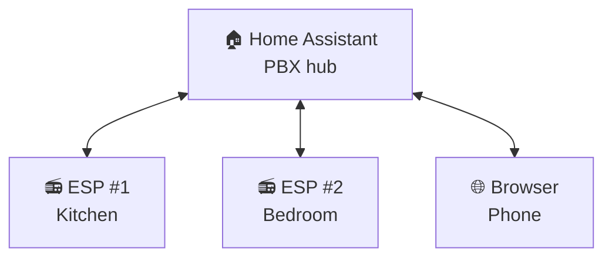

## Features

- **Full-duplex audio** - Talk and listen simultaneously
- **Two operating modes**:
  - **Simple**: Browser ↔ Home Assistant ↔ ESP
  - **Full**: ESP ↔ Home Assistant ↔ ESP (intercom between devices)
- **Echo Cancellation (AEC)** - Built-in acoustic echo cancellation using ESP-SR
  *(ES8311 digital feedback mode provides perfect sample-accurate echo cancellation)*
- **Full Audio Front-End (AFE)** - Complete ESP-SR AFE pipeline via `esp_afe`:
  - **Single-mic (MR)**: AEC + Noise Suppression + VAD + AGC
  - **Dual-mic (MMR)**: AEC + Beamforming (BSS) for spatial voice isolation
  - Runtime switches and diagnostic sensors in Home Assistant
  - Automatic pipeline switching: SE(BSS) replaces NS/AGC when beamforming is active
- **Voice Assistant compatible** - Coexists with ESPHome Voice Assistant and Micro Wake Word
- **Ready-to-flash YAML configs** - Optimized configurations for real, tested hardware that combine Voice Assistant, Micro Wake Word, and Intercom running simultaneously, creating the most complete hub possible for a full Voice Assistant experience
- **Auto Answer** - Configurable automatic call acceptance (ESP-side switch + browser card checkbox)
- **HA Services** - Native `intercom_native.answer`, `decline`, `hangup`, `call`, `forward` services for automation control
- **Call Forwarding** - PBX-like call routing: forward active calls to other devices via automation
- **Ringtone on incoming calls** - Devices play a looping ringtone sound while ringing
- **Volume Control** - Adjustable speaker volume and microphone gain
- **Contact Management** - Select call destination from discovered devices
- **Status LED** - Visual feedback for call states
- **Persistent Settings** - Volume, gain, AEC state saved to flash
- **Remote Access** - Works through any HA remote access method (Nabu Casa, reverse proxy, VPN). No WebRTC, no go2rtc, no port forwarding required

---

## Architecture

### System Overview

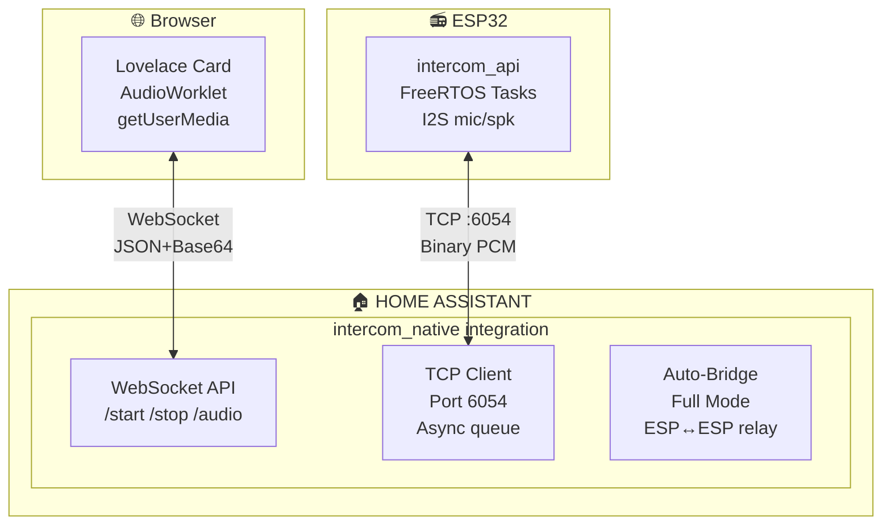

### Intercom Audio Format (TCP Protocol)

| Parameter | Value |
|-----------|-------|
| Sample Rate | 16000 Hz |
| Bit Depth | 16-bit signed PCM |
| Channels | Mono |
| ESP Chunk Size | 1024 bytes (512 samples = 32ms) |
| Browser Chunk Size | 1024 bytes (512 samples = 32ms) |

### TCP Protocol (Port 6054)

**Header (4 bytes):**

| Byte 0 | Byte 1 | Bytes 2-3 |
|--------|--------|-----------|
| Type | Flags | Length (LE) |

**Message Types:**

| Code | Name | Description |
|------|------|-------------|
| 0x01 | AUDIO | PCM audio data |
| 0x02 | START | Start streaming (includes caller_name, no_ring flag) |
| 0x03 | STOP | Stop streaming |
| 0x04 | PING | Keep-alive |
| 0x05 | PONG | Keep-alive response |
| 0x06 | ERROR | Error notification |

---

## Installation

### 1. Home Assistant Integration

#### Option A: Install via HACS (Recommended)

1. In HACS, go to **⋮ → Custom repositories**
2. Add `https://github.com/n-IA-hane/esphome-intercom` as **Integration**
3. Find "Intercom Native" and click **Download**
4. Restart Home Assistant
5. Go to **Settings → Integrations → Add Integration** → search "Intercom Native" → click **Submit**

The integration automatically registers the Lovelace card, no manual frontend setup needed.

#### Option B: Manual install

```bash
# From the repository root
cp -r custom_components/intercom_native /config/custom_components/
```

Then either:
- Add via UI: **Settings → Integrations → Add Integration → Intercom Native**
- Or add to `configuration.yaml`: `intercom_native:`

Restart Home Assistant.

The integration will:
- Register WebSocket API commands for the card
- Create `sensor.intercom_active_devices` (lists all intercom ESPs)
- Auto-detect ESP state changes for Full Mode bridging
- Auto-register the Lovelace card as a frontend resource

### 2. ESPHome Component

Add the external component to your ESPHome device configuration:

```yaml
# Lightweight (single-mic, echo cancellation only):
external_components:
  - source: github://n-IA-hane/esphome-intercom
    components: [audio_processor, intercom_api, esp_aec]

# Full AFE pipeline (AEC + NS + VAD + AGC, optional beamforming):
external_components:
  - source: github://n-IA-hane/esphome-intercom
    ref: audio-core-v2
    components: [audio_processor, intercom_api, esp_afe, i2s_audio_duplex]
```

> **Note**: `audio_processor` must be listed because it provides the shared `AudioProcessor` interface used by both `esp_aec` and `esp_afe`. Use `esp_aec` for lightweight single-mic setups, `esp_afe` for the full pipeline (see [AFE section](#audio-front-end-afe) below).

#### Minimal Configuration (Simple Mode)

```yaml
esp32:
  board: esp32-s3-devkitc-1
  framework:
    type: esp-idf
    sdkconfig_options:
      # Default is 10, increased for: TCP server + API + OTA
      CONFIG_LWIP_MAX_SOCKETS: "16"

# I2S Audio (example with separate mic/speaker)
i2s_audio:
  - id: i2s_mic_bus
    i2s_lrclk_pin: GPIO3
    i2s_bclk_pin: GPIO2
  - id: i2s_spk_bus
    i2s_lrclk_pin: GPIO6
    i2s_bclk_pin: GPIO7

microphone:
  - platform: i2s_audio
    id: mic_component
    i2s_audio_id: i2s_mic_bus
    i2s_din_pin: GPIO4
    adc_type: external
    pdm: false
    bits_per_sample: 32bit
    sample_rate: 16000

speaker:
  - platform: i2s_audio
    id: spk_component
    i2s_audio_id: i2s_spk_bus
    i2s_dout_pin: GPIO8
    dac_type: external
    sample_rate: 16000
    bits_per_sample: 16bit

# Echo Cancellation (recommended)
esp_aec:
  id: aec_processor
  sample_rate: 16000
  filter_length: 4       # 64ms tail length
  mode: voip_low_cost    # Optimized for real-time

# Intercom API - Simple mode (browser only)
intercom_api:
  id: intercom
  mode: simple
  microphone: mic_component
  speaker: spk_component
  processor_id: aec_processor
```

#### Full Configuration (Full Mode with ESP↔ESP)

```yaml
intercom_api:
  id: intercom
  mode: full                  # Enable ESP↔ESP calls
  microphone: mic_component
  speaker: spk_component
  processor_id: aec_processor
  ringing_timeout: 30s        # Auto-decline unanswered calls

  # FSM event callbacks
  on_ringing:
    - light.turn_on:
        id: status_led
        effect: "Ringing"

  on_outgoing_call:
    - light.turn_on:
        id: status_led
        effect: "Calling"

  on_streaming:
    - light.turn_on:
        id: status_led
        red: 0%
        green: 100%
        blue: 0%

  on_idle:
    - light.turn_off: status_led

# Switches (with restore from flash)
switch:
  - platform: intercom_api
    intercom_api_id: intercom
    auto_answer:
      name: "Auto Answer"
      restore_mode: RESTORE_DEFAULT_OFF
    aec:
      name: "Echo Cancellation"
      restore_mode: RESTORE_DEFAULT_ON

# Volume controls
number:
  - platform: intercom_api
    intercom_api_id: intercom
    speaker_volume:
      name: "Speaker Volume"
    mic_gain:
      name: "Mic Gain"

# Buttons for manual control
button:
  - platform: template
    name: "Call"
    on_press:
      - intercom_api.call_toggle:
          id: intercom

  - platform: template
    name: "Next Contact"
    on_press:
      - intercom_api.next_contact:
          id: intercom

# Subscribe to HA's contact list (Full mode)
text_sensor:
  - platform: homeassistant
    id: ha_active_devices
    entity_id: sensor.intercom_active_devices
    on_value:
      - intercom_api.set_contacts:
          id: intercom
          contacts_csv: !lambda 'return x;'

# Example: call a specific room from HA automation
# or use in YAML lambda with intercom_api.set_contact
button:
  - platform: template
    name: "Call Kitchen"
    on_press:
      - intercom_api.set_contact:
          id: intercom
          contact: "Kitchen Intercom"
      - intercom_api.start:
          id: intercom
```

#### Direct GPIO Calls (Apartment Intercom)

Each GPIO button can call a different room, like a condominium intercom panel:

```yaml
binary_sensor:
  # Button 1: Call Kitchen
  - platform: gpio
    pin:
      number: GPIO4
      mode: INPUT_PULLUP
      inverted: true
    on_press:
      - intercom_api.set_contact:
          id: intercom
          contact: "Kitchen Intercom"
      - intercom_api.start:
          id: intercom

  # Button 2: Call Living Room
  - platform: gpio
    pin:
      number: GPIO5
      mode: INPUT_PULLUP
      inverted: true
    on_press:
      - intercom_api.set_contact:
          id: intercom
          contact: "Living Room Intercom"
      - intercom_api.start:
          id: intercom
```

> ⚠️ **Name matching is exact (case-sensitive).** The `contact` value must match the device name exactly as it appears in the contacts list. There is no fuzzy matching or validation; a typo will silently fail and fire `on_call_failed`.
>
> Contact names come from the `name:` substitution in each device's YAML. Home Assistant converts the ESPHome name to a display name: `name: kitchen-intercom` → HA device name `Kitchen Intercom` (hyphens become spaces, words capitalized).
>
> **How to verify the correct name:** check the `sensor.{name}_destination` entity in HA, cycle through contacts, and note the exact string shown for each device.

### 3. Lovelace Card

The Lovelace card is **automatically registered** when the integration loads, no manual file copying or resource registration needed.

#### Add the card to your dashboard

The card is available in the Lovelace card picker - just search for "Intercom":

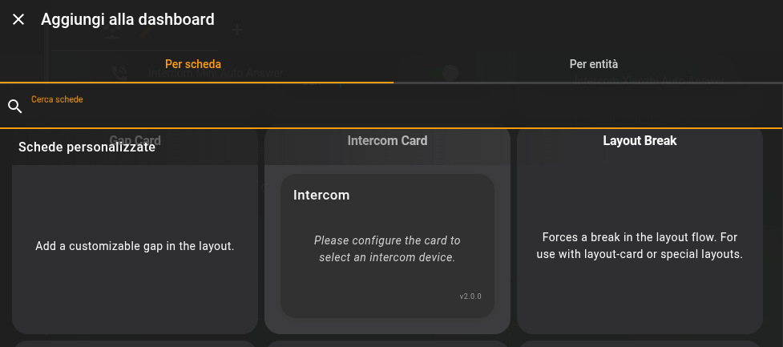

Then configure it with the visual editor:

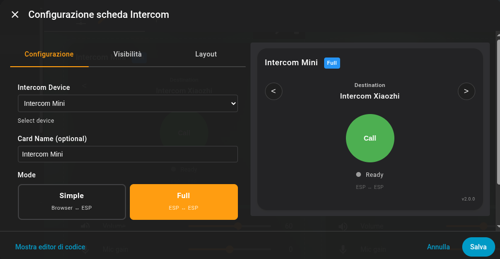

Alternatively, you can add it manually via YAML:

```yaml
type: custom:intercom-card
entity_id: <your_esp_device_id>
name: Kitchen Intercom
mode: full  # or 'simple'
```

The card automatically discovers ESPHome devices with the `intercom_api` component.

The Lovelace card provides **full-duplex bidirectional audio** with the ESP device: you can talk and listen simultaneously through your browser or the Home Assistant Companion app. The card captures audio from your microphone via `getUserMedia()` and plays incoming audio from the ESP in real-time.

> **Important: HTTPS required.** Browser microphone access (`getUserMedia`) requires a secure context. You need HTTPS to use the card's audio features. Solutions: [Nabu Casa](https://www.nabucasa.com/), Let's Encrypt, reverse proxy with SSL, or self-signed certificate. Exception: `localhost` works without HTTPS.

> **Note**: Devices must be added to Home Assistant via the ESPHome integration before they appear in the card.


---

## Operating Modes

### Simple Mode (Browser ↔ ESP)

In Simple mode, the browser communicates directly with a single ESP device through Home Assistant. If the ESP has **Auto Answer** enabled, streaming starts automatically when you call.

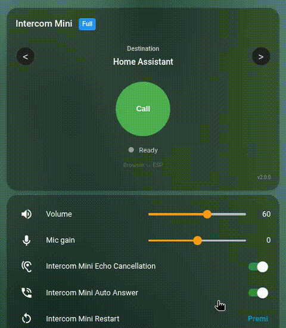


**Call Flow (Browser → ESP):**
1. User clicks "Call" in browser
2. Card sends `intercom_native/start` to HA
3. HA opens TCP connection to ESP:6054
4. HA sends START message (caller="Home Assistant")
5. ESP enters Ringing state (or auto-answers if enabled)
6. User can answer on the ESP via GPIO button, LVGL touchscreen button, or HA automation
7. Bidirectional audio streaming begins

**Call Flow (ESP → Browser):**
1. User presses "Call" on ESP via GPIO button or LVGL touchscreen (with destination set to "Home Assistant")
2. ESP sends RING message to HA
3. HA notifies all connected browser cards
4. Card shows incoming call with Answer/Decline buttons
5. User clicks "Answer" in browser (or auto-answer if enabled on the card)
6. Bidirectional audio streaming begins

**Use Simple mode when:**
- You want a simple doorbell with full-duplex audio
- You need browser-to-ESP **and** ESP-to-browser communication
- You want minimal configuration

### Full Mode (PBX-like)

Full mode includes everything from Simple mode (Browser ↔ ESP calls) **plus** enables a PBX-like system where ESP devices can also call each other through Home Assistant, which acts as an audio relay.

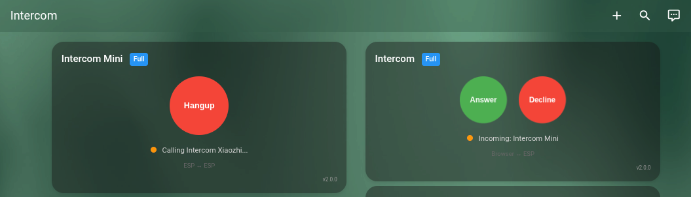

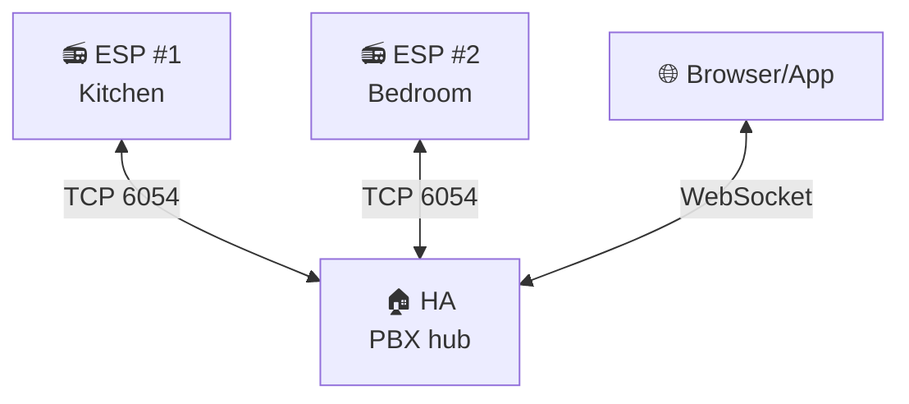

**Call Flow (ESP #1 calls ESP #2):**
1. User selects "Bedroom" on ESP #1 via display or button
2. User presses Call (GPIO button or LVGL touchscreen) → ESP #1 enters "Outgoing" state
3. HA detects state change via ESPHome API
4. HA sends START to ESP #2 (caller="Kitchen")
5. ESP #2 enters "Ringing" state
6. User answers on ESP #2 (GPIO button, LVGL touch, or auto-answer if enabled)
7. HA bridges audio: ESP #1 ↔ HA ↔ ESP #2
8. Either device can hangup (button, touch, or HA service) → STOP propagates to both

**Full mode features:**
- Contact list auto-discovery from HA
- Next/Previous contact navigation
- Caller ID display
- Ringing timeout with auto-decline
- Bidirectional hangup propagation

### ESP calling Home Assistant (Doorbell)

When an ESP device has "Home Assistant" selected as destination and initiates a call (via GPIO button press or template button), it fires an `esphome.intercom_call` event for notifications and the Lovelace card goes into ringing state with Answer/Decline buttons:

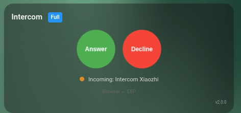

---


## Reference

Full options, actions, conditions, entities, services and automation examples are documented in **[docs/reference.md](docs/reference.md)**.

Quick links:
- [`intercom_api` component options](docs/reference.md#intercom_api-component)
- [Event callbacks](docs/reference.md#event-callbacks)
- [Actions](docs/reference.md#actions) and [conditions](docs/reference.md#conditions)
- [`esp_aec`](docs/reference.md#esp_aec-component) / [`esp_afe`](docs/reference.md#esp_afe-component) components
- [Home Assistant services](docs/reference.md#home-assistant-services)
- [Automation examples](docs/reference.md#automation-examples) (doorbell routing, night mode, forward, bridge)


## Call Flow Diagrams

### Simple Mode: Browser calls ESP

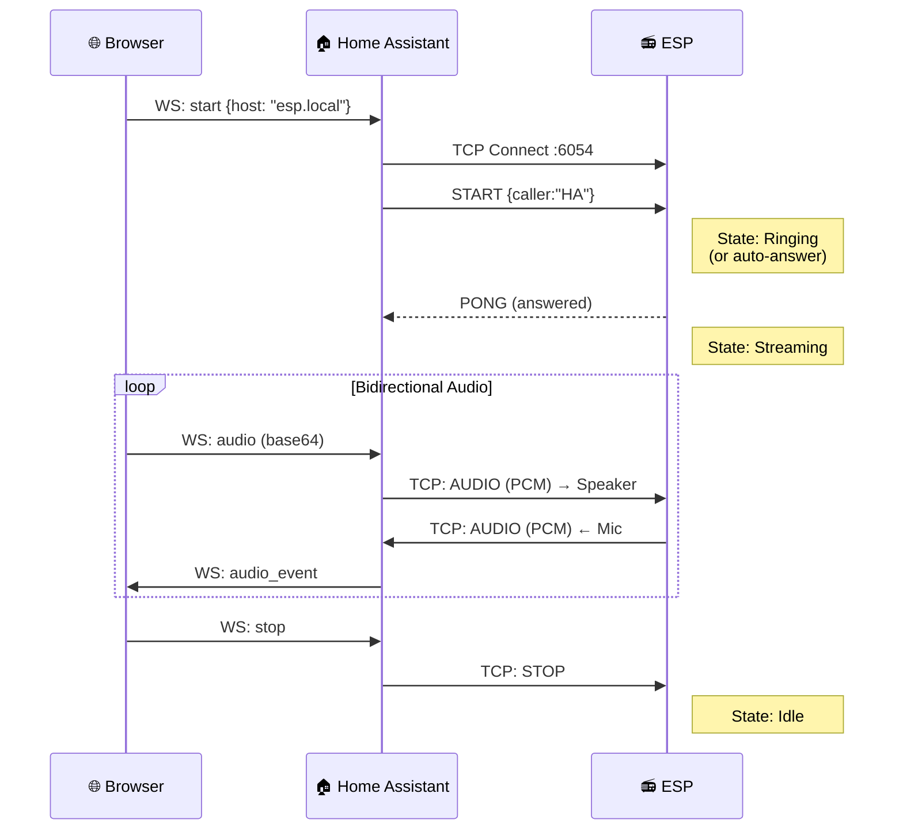

### Full Mode: ESP calls ESP

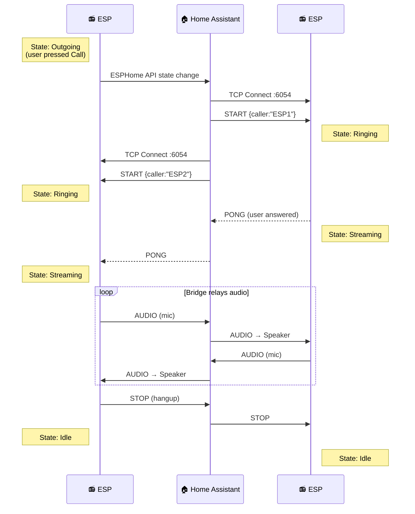

---

## Hardware Support

### Tested Configurations

| Device | YAML | Microphone | Speaker | I2S Mode | Audio pipeline | Features |
|--------|------|------------|---------|----------|----------------|----------|
| **Xiaozhi Ball V3 (AEC)** | [`xiaozhi-full-aec.yaml`](yamls/full-experience/single-bus/aec/xiaozhi-full-aec.yaml) | ES8311 | ES8311 | Single bus | `esp_aec` (SR stereo loopback) | VA + MWW + Intercom + LVGL |
| **Xiaozhi Ball V3 (AFE)** | [`xiaozhi-ball-v3-full-afe.yaml`](yamls/full-experience/single-bus/afe/xiaozhi-ball-v3-full-afe.yaml) | ES8311 | ES8311 | Single bus | `esp_afe` (AEC + NS + AGC + VAD) | VA + MWW + Intercom + LVGL |
| **Xiaozhi Ball V3 (intercom)** | [`xiaozhi-intercom.yaml`](yamls/intercom-only/single-bus/xiaozhi-intercom.yaml) | ES8311 | ES8311 | Single bus | `esp_aec` (SR stereo loopback) | Intercom only |
| **Waveshare S3-Audio (AEC)** | [`waveshare-s3-full-aec.yaml`](yamls/full-experience/single-bus/aec/waveshare-s3-full-aec.yaml) | ES7210 4-ch | ES8311 | Single bus TDM | `esp_aec` (SR, MIC3 ref) | VA + MWW + Intercom + LED |
| **Waveshare S3-Audio (AFE)** | [`waveshare-s3-full-afe.yaml`](yamls/full-experience/single-bus/afe/waveshare-s3-full-afe.yaml) | ES7210 4-ch | ES8311 | Single bus TDM | `esp_afe` (AEC + BSS beamforming + NS + AGC) | VA + MWW + Intercom + LED + AFE switches/sensors |
| **Waveshare P4-Touch (AEC)** | [`waveshare-p4-full-aec.yaml`](yamls/full-experience/single-bus/aec/waveshare-p4-full-aec.yaml) | ES7210 4-ch | ES8311 | Single bus TDM | `esp_aec` (SR, MIC3 ref) | VA + MWW + Intercom + LVGL touch |
| **Waveshare P4-Touch (AFE)** | [`waveshare-p4-full-afe.yaml`](yamls/full-experience/single-bus/afe/waveshare-p4-full-afe.yaml) | ES7210 4-ch | ES8311 | Single bus TDM | `esp_afe` (AEC + BSS beamforming + NS + AGC) | VA + MWW + Intercom + LVGL touch |
| **ESP32-S3 Mini** | [`esp32-s3-mini-full.yaml`](yamls/full-experience/dual-bus/esp32-s3-mini-full.yaml) | SPH0645 | MAX98357A | Dual bus | Ring-buffer reference (intercom_api) | VA + MWW + Intercom |
| **ESP32-S3 Mini (intercom)** | [`esp32-s3-mini-intercom.yaml`](yamls/intercom-only/dual-bus/esp32-s3-mini-intercom.yaml) | SPH0645 | MAX98357A | Dual bus | Ring-buffer reference (intercom_api) | Intercom only |
| **Generic S3 (intercom)** | [`generic-s3-intercom.yaml`](yamls/intercom-only/single-bus/generic-s3-intercom.yaml) | Any I2S MEMS | Any I2S amp | Single bus (duplex) | `esp_aec` (direct TX reference) | Intercom only |
| **Generic S3 (dual bus)** | [`generic-s3-dual-intercom.yaml`](yamls/intercom-only/dual-bus/generic-s3-dual-intercom.yaml) | Any I2S MEMS | Any I2S amp | Dual bus | Ring-buffer reference (intercom_api) | Intercom only |

> **Want to help expand this list?** Send me a device to test or consider a [donation](https://github.com/sponsors/n-IA-hane), every bit helps!

### Requirements

- **ESP32-S3** or **ESP32-P4** with PSRAM (required for AEC)
- I2S microphone (INMP441, SPH0645, ES8311, etc.)
- I2S speaker amplifier (MAX98357A, ES8311, etc.)
- ESP-IDF framework (not Arduino)
- **sdkconfig tuning** for PSRAM devices: `DATA_CACHE_64KB` + `DATA_CACHE_LINE_64B` (S3) or `CACHE_L2_CACHE_256KB` (P4), plus `SPIRAM_FETCH_INSTRUCTIONS` + `SPIRAM_RODATA`. See [i2s_audio_duplex README](esphome/components/i2s_audio_duplex/README.md#psram-and-sdkconfig-requirements) for details.

---

## i2s_audio_duplex

Standard ESPHome `i2s_audio` **cannot drive mic and speaker on the same I2S bus simultaneously**. This is a problem for most audio codecs (ES8311, ES8388, WM8960) and single-bus setups with discrete MEMS mics and I2S amps. **[i2s_audio_duplex](esphome/components/i2s_audio_duplex/)** solves this.

### Why it matters

Without full-duplex I2S, you can't have Voice Assistant, Micro Wake Word, intercom, and media playback all running at the same time. With `i2s_audio_duplex`:

- **Intercom, VA, and MWW receive completely clean audio** - echo cancellation removes speaker output from the mic signal. You can listen to music, receive an intercom call, and talk to the voice assistant without any of them hearing each other's audio
- **Wake word detection works during music/TTS playback** - barge-in support: say the wake word while music is playing, the system ducks the audio and starts listening
- **Media plays at full quality** - the I2S bus runs at 48kHz (codec native rate). Only the mic output is decimated to 16kHz via FIR filter for AEC/VA/intercom

### Key features

- **True full-duplex** on a single I2S bus (or discrete MEMS mic + I2S amp on same bus with `slot_bit_width: 32`)
- **Three AEC reference modes**, all zero-configuration:
  - **Direct TX reference** (default) - uses previous TX frame, no delay tuning needed. Works with any hardware
  - **ES8311 stereo digital feedback** - sample-accurate DAC loopback via I2S stereo frame
  - **ES7210 TDM hardware reference** - DAC output captured by dedicated ADC channel
- **48kHz FIR decimation** - bus runs at 48kHz, mic output decimated to 16kHz (31-tap Kaiser FIR, ~60dB stopband)
- **Dual mic outputs** - post-AEC mic for VA/STT/intercom, raw (pre-AEC) mic available for any consumer that needs unprocessed audio
- **Pre-AEC and post-AEC gain** - `mic_gain_pre_aec` for weak MEMS mics (SPH0645), `mic_gain` for post-AEC amplification. Both as HA number entities, persistent across reboots
- **Runtime AEC mode switching** - change between sr_low_cost, sr_high_perf, voip_low_cost, voip_high_perf from HA without reflashing
- **DC offset correction** - `correct_dc_offset: true` for MEMS mics without built-in HPF (MSM261, SPH0645)
- **PSRAM buffer support** - `buffers_in_psram` frees ~28KB internal heap (required for SR AEC on memory-constrained devices)
- **Audio mixer with ducking** - combine media, TTS, and intercom through a mixer. Music auto-ducks during calls and VA interactions

### Quick start

```yaml
external_components:
  - source: github://n-IA-hane/esphome-intercom
    components: [audio_processor, i2s_audio_duplex, esp_aec]

esp_aec:
  id: aec_processor
  sample_rate: 16000
  mode: sr_low_cost

i2s_audio_duplex:
  id: i2s_duplex
  i2s_lrclk_pin: GPIO37
  i2s_bclk_pin: GPIO36
  i2s_din_pin: GPIO35          # mic data
  i2s_dout_pin: GPIO7          # speaker data
  sample_rate: 48000
  output_sample_rate: 16000    # FIR decimation to 16kHz
  slot_bit_width: 32           # required for MEMS mics without codec
  correct_dc_offset: true
  processor_id: aec_processor

microphone:
  - platform: i2s_audio_duplex
    id: mic_aec
    i2s_audio_duplex_id: i2s_duplex

speaker:
  - platform: i2s_audio_duplex
    id: hw_speaker
    i2s_audio_duplex_id: i2s_duplex
    sample_rate: 48000
```

For codec-specific configurations (ES8311 stereo feedback, ES7210 TDM, register setup), see the [i2s_audio_duplex README](esphome/components/i2s_audio_duplex/README.md).

---

## Audio Front-End (AFE)

> **Experimental.** The AFE integration is functional but should be considered experimental. Evaluate carefully whether your use case requires it.

The `esp_afe` component integrates Espressif's ESP-SR Audio Front-End framework, providing a complete audio processing pipeline beyond basic echo cancellation.

### What AFE adds over esp_aec

| Feature | esp_aec | esp_afe |
|---------|---------|---------|
| Echo Cancellation (AEC) | Yes | Yes |
| Noise Suppression (NS) | No | Yes (WebRTC) |
| Voice Activity Detection (VAD) | No | Yes |
| Automatic Gain Control (AGC) | No | Yes |
| Beamforming (BSS) | No | Yes (dual-mic only) |
| Runtime feature toggles | Mode only | All features via HA switches |
| Diagnostic sensors | None | Input volume, output RMS, VAD state |

### Resource cost

The ESP-SR AFE framework is a closed-source binary library originally designed for IDF-centric applications. It carries a significant fixed resource cost, even when configured with the lightest options and all non-essential buffers placed in PSRAM:

| Configuration | Internal RAM | PSRAM | CPU (both cores) |
|---------------|-------------|-------|------------------|
| 1 mic + ref (MR SR LOW_COST) | ~72 KB | ~733 KB | ~23% |
| 2 mic + ref, beamforming (MMNR SR LOW_COST) | ~77 KB | ~1.2 MB | ~67% |

These costs are fixed once the AFE is initialized. Disabling features at runtime skips processing but does not free memory. Only the `*_init` flags at creation time control memory allocation.

### When to use esp_afe vs esp_aec

- **Use `esp_aec`** for single-mic devices where you only need echo cancellation. It is lightweight (~40 KB total), has minimal CPU impact, and is battle-tested on all supported hardware. This is the recommended choice for most intercom-only setups.

- **Use `esp_afe`** when you need noise suppression, AGC, VAD, or dual-mic beamforming. On single-mic boards the AFE works and provides NS/AGC/VAD, but the resource cost is substantial. On dual-mic boards (e.g., Waveshare S3/P4 with ES7210), beamforming provides real spatial voice isolation that esp_aec cannot offer.

### Dual-mic beamforming

On boards with two physical microphones (ES7210 TDM), enabling SE (Speech Enhancement/beamforming) activates BSS (Blind Source Separation). This uses both microphones to spatially isolate the speaker's voice from ambient noise and other sound sources.

```yaml
esp_afe:
  id: afe_processor
  type: sr
  mode: low_cost
  mic_num: 2
  se_enabled: true           # Beamforming ON
  # ...

i2s_audio_duplex:
  processor_id: afe_processor
  use_tdm_reference: true
  tdm_total_slots: 4
  tdm_mic_slots: [0, 2]     # Physical mic slots in TDM frame
  tdm_ref_slot: 1           # DAC feedback reference slot
```

Beamforming can be toggled at runtime via a Home Assistant switch. When turned off, the system automatically restarts with single-mic processing, saving one FIR decimator, one DC offset filter, and the beamforming CPU cost.

---

## Voice Assistant + Intercom Experience

<table>
  <tr>
    <td align="center"><br/><b>ESP32-P4: Weather + Voice Assistant</b></td>
    <td align="center"><br/><b>ESP32-P4: Intercom + Voice Assistant</b></td>
    <td align="center">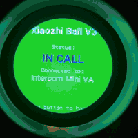<br/><b>Xiaozhi Ball: VA + Intercom</b></td>
  </tr>
</table>

The Voice Assistant, Micro Wake Word, and Intercom coexist seamlessly on the same hardware: shared microphone, shared speaker (via 3-source audio mixer with ducking), always-on wake word detection. No display required (works on headless devices like the Waveshare S3 Audio); on devices with a screen, you also get a full touch UI:

- **Always listening**: Micro Wake Word runs continuously on **post-AEC** audio (`stop_after_detection: false`). SR linear AEC preserves the spectral features that the neural wake word model relies on (10/10 detection vs 2/10 with VOIP AEC modes). MWW detects the wake word even while TTS is playing, during music, or during an intercom call
- **Audio ducking**: When the wake word is detected, background music automatically ducks (-20dB). Volume restores when the VA cycle ends. During intercom calls, music is also ducked. The 3-source mixer (media + TTS + intercom) enables independent volume control per source
- **Barge-in**: Say the wake word during a TTS response to interrupt and ask a new question. The barge-in state machine (`restart_intent` flag + `va_end_handler` script with `mode: restart`) ensures clean pipeline teardown and restart, waiting for VA to reach IDLE before restarting (`voice_assistant.start` is silently ignored if not IDLE)
- **Touch or voice**: Start the assistant by saying the wake word or tapping the screen (on touch displays)
- **Intercom calls**: Call other devices or Home Assistant with one tap; incoming calls ring with audio + visual feedback. Ringtone plays over music (via announcement pipeline)
- **Runtime AEC mode switching**: An `AEC Mode` select entity in Home Assistant lets you switch between SR and VOIP AEC modes at runtime without reflashing
- **Weather at a glance**: Current conditions, temperature, and 5-day forecast updated automatically (touch displays)
- **Mood-aware responses**: The assistant shows different expressions (happy, neutral, angry) based on the tone of its reply. Requires instructing your LLM to prepend an ASCII emoticon (`:-)` `:-(` `:-|`) to each response based on its tone
- **Custom AI avatars**: On devices with a display, you can create your own assistant avatar by providing a set of PNG images in a standard folder structure. Set the `ai_avatar` substitution in your YAML to pick which avatar to use:

  ```yaml
  substitutions:
    ai_avatar: my_assistant    # uses images/assistant/my_assistant/
  ```

  Each avatar folder must contain the following files:

  | File | Purpose |
  |------|---------|
  | `idle_00.png` ... `idle_19.png` | Idle animation frames (20 frames, looped) |
  | `listening.png` | Displayed while the assistant is listening |
  | `thinking.png` | Displayed while the assistant is processing |
  | `loading.png` | Displayed during initialization |
  | `error.png` | Displayed on assistant error |
  | `timer_finished.png` | Displayed when a timer completes |
  | `happy.png` | Mood background for positive responses |
  | `neutral.png` | Mood background for neutral responses |
  | `angry.png` | Mood background for negative responses |
  | `error_no_wifi.png` | WiFi disconnected overlay |
  | `error_no_ha.png` | Home Assistant disconnected overlay |

  The folder name matches the avatar identity (e.g. `images/assistant/troiaio/`). To switch avatar, just change the substitution. Images are resized automatically at compile time (240x240 for Xiaozhi Ball, 400x400 for P4 Touch LCD).

### AEC Best Practices

AEC uses Espressif's closed-source ESP-SR library. All modes have similar CPU cost per frame (~7ms out of 16ms budget). The difference is primarily in memory allocation and adaptive filter quality.

**Recommended: `sr_low_cost`** for VA + MWW setups (i2s_audio_duplex devices). Linear-only AEC preserves spectral features for neural wake word detection (10/10 vs 2/10 with VOIP modes). Also uses ~60% less CPU. Requires `buffers_in_psram: true` on ESP32-S3. For dual-bus devices without i2s_audio_duplex, use `voip_high_perf` (AEC runs inside intercom_api).

For devices that benefit from noise suppression and auto gain control (noisy environments, variable mic distance), use `esp_afe` instead of `esp_aec`. The AFE wraps the same AEC engine plus WebRTC NS and AGC, with runtime switches in Home Assistant.

```yaml
# Option A: esp_aec (AEC only, lighter)
esp_aec:
  sample_rate: 16000
  filter_length: 4       # 64ms tail, sufficient for integrated codecs
  mode: sr_low_cost      # Linear AEC, best for MWW + VA, lowest CPU

# Option B: esp_afe (AEC + NS + VAD + AGC, full pipeline)
# esp_afe:
#   type: sr
#   mode: low_cost
#   ns_enabled: true
#   agc_enabled: true

i2s_audio_duplex:
  # ... pins ...
  processor_id: aec_component   # works with either esp_aec or esp_afe
  buffers_in_psram: true  # Required for sr_low_cost (512-sample frames)
```

Use `voip_low_cost` only if you don't need wake word detection and want more aggressive echo suppression for VoIP-only use cases.

**Avoid `sr_high_perf`**: It allocates very large DMA buffers that can exhaust memory on ESP32-S3, causing SPI errors and instability.

### AEC Timeout Gating

AEC processing is automatically gated: it only runs when the speaker had real audio within the last 250ms. When the speaker is silent (idle, no TTS, no intercom audio), AEC is bypassed and mic audio passes through unchanged.

This prevents the adaptive filter from drifting during silence, which would otherwise suppress the mic signal and kill wake word detection. The gating is transparent, no configuration needed.

### Custom Wake Words

Two custom Micro Wake Word models trained by the author are included in the `wakewords/` directory:

- **Hey Bender** (`hey_bender.json`): inspired by the Futurama character
- **Hey Trowyayoh** (`hey_trowyayoh.json`): phonetic spelling of the Italian word *"troiaio"* (roughly: "what a mess", or more colorfully, "bullshit")

These are standard `.json` + `.tflite` files compatible with ESPHome's `micro_wake_word`. To use them:

```yaml
micro_wake_word:
  models:
    - model: "wakewords/hey_trowyayoh.json"
```

### LVGL Display

Running a display alongside Voice Assistant, Micro Wake Word, AEC, and intercom on a single ESP32-S3 is challenging due to RAM and CPU constraints. The `xiaozhi-full-aec.yaml` and `waveshare-p4-full-aec.yaml` configs demonstrate proven approaches using **LVGL** (Light and Versatile Graphics Library):

| Before (ili9xxx manual) | After (LVGL) |
|---|---|
| 14 C++ page lambdas | Declarative YAML widgets |
| 26 `component.update` calls | Automatic dirty-region refresh |
| `animate_display` script (40 lines) | `animimg` widget (built-in) |
| `text_pagination_timer` script | `long_mode: SCROLL_CIRCULAR` |
| Precomputed geometry (chord widths, x/y metrics) | LVGL layout engine |
| Manual ping-pong frame logic | Duplicated frame list in `animimg src:` |

Key benefits: lower CPU (dirty-region only), no `component.update` contention, native animation (`animimg`), mood-based backgrounds via `lv_img_set_src()`, and automatic text scrolling (`SCROLL_CIRCULAR`).

Timer overlays use `top_layer` with `LV_OBJ_FLAG_HIDDEN`, visible on any page. Media files are auto-resampled by the `platform: resampler` speaker in the mixer pipeline.

### Experiment and Tune

Every setup is different: room acoustics, mic sensitivity, speaker placement, codec characteristics. We encourage you to:

- **Try different `filter_length` values** (4 vs 8), longer isn't always better if your acoustic path is short
- **Toggle AEC on/off during calls** to hear the difference; the `aec` switch is available in HA
- **Adjust `mic_gain`** (-20 to +30 dB): higher gain helps voice detection but can introduce noise
- **Test MWW during TTS** with your specific wake word, some words are more robust than others
- **Compare `voip_low_cost` vs `voip_high_perf`**: the difference may be subtle in your environment
- **Monitor ESP logs**: AEC diagnostics, task timing, and heap usage are all logged at DEBUG level

---

## Troubleshooting

### Card shows "No devices found"

1. Verify `intercom_native:` is in `configuration.yaml`
2. Restart Home Assistant after adding the integration
3. Ensure ESP device is connected via ESPHome integration
4. Check ESP has `intercom_api` component configured
5. Clear browser cache and reload

### No audio from ESP speaker

1. Check speaker wiring and I2S pin configuration
2. Verify `speaker_enable` GPIO if your amp has an enable pin
3. Check volume level (default 80%)
4. Look for I2S errors in ESP logs

### No audio from browser

1. Check browser microphone permissions
2. Verify HTTPS (required for getUserMedia)
3. Check browser console for AudioContext errors
4. Try a different browser (Chrome recommended)

### Echo or feedback

1. Enable AEC: create an audio processor (`esp_aec` or `esp_afe`) and link with `aec_id` (intercom_api) or `processor_id` (i2s_audio_duplex)
2. Ensure AEC switch is ON in Home Assistant
3. Reduce speaker volume
4. Increase physical distance between mic and speaker

### High latency

1. Check WiFi signal strength (should be > -70 dBm)
2. Verify Home Assistant is not overloaded
3. Check for network congestion
4. Reduce ESP log level to `WARN`

### ESP shows "Ringing" but browser doesn't connect

1. Check TCP port 6054 is accessible
2. Verify no firewall blocking HA→ESP connection
3. Check Home Assistant logs for connection errors
4. Try restarting the ESP device

### Full mode: ESP doesn't see other devices

1. Ensure all ESPs use `mode: full`
2. Verify `sensor.intercom_active_devices` exists in HA
3. Check ESP subscribes to this sensor via `text_sensor: platform: homeassistant`
4. Devices must be online and connected to HA

---

## Home Assistant Automation

When an ESP device calls "Home Assistant", it fires an `esphome.intercom_call` event. Use this to trigger push notifications, flash lights, play chimes, or any other automation.

See [examples/doorbell-automation.yaml](examples/doorbell-automation.yaml) for a ready-to-use doorbell notification with mobile push and action buttons.

---

## Example Dashboard

See [examples/dashboard.yaml](examples/dashboard.yaml) for a complete Lovelace dashboard with intercom card, volume controls, AEC mode select, auto answer, wake word, and mute switches.

---

## Example YAML Files

Working configs tested on real hardware, organized by use case. Not sure which one to pick? See the [Deployment Guide](docs/DEPLOYMENT_GUIDE.md) for a decision tree.

### Full Experience with `esp_aec` (VA + MWW + Intercom, lighter)

| File | Device | Audio |
|------|--------|-------|
| [`xiaozhi-full-aec.yaml`](yamls/full-experience/single-bus/aec/xiaozhi-full-aec.yaml) | Xiaozhi Ball V3 (ES8311, LVGL) | Single-bus stereo AEC |
| [`waveshare-s3-full-aec.yaml`](yamls/full-experience/single-bus/aec/waveshare-s3-full-aec.yaml) | Waveshare S3-AUDIO (ES8311+ES7210) | TDM dual-mic, MIC3 reference |
| [`waveshare-p4-full-aec.yaml`](yamls/full-experience/single-bus/aec/waveshare-p4-full-aec.yaml) | Waveshare P4-Touch-LCD (ES8311+ES7210) | TDM dual-mic, MIC3 reference, LVGL touch |
| [`esp32-s3-mini-full.yaml`](yamls/full-experience/dual-bus/esp32-s3-mini-full.yaml) | ESP32-S3 Mini (SPH0645+MAX98357A) | Dual-bus, ring-buffer reference, LED feedback |

### Full Experience with `esp_afe` (VA + MWW + Intercom + NS/AGC/VAD, heavier)

| File | Device | Audio |
|------|--------|-------|
| [`xiaozhi-ball-v3-full-afe.yaml`](yamls/full-experience/single-bus/afe/xiaozhi-ball-v3-full-afe.yaml) | Xiaozhi Ball V3 (ES8311, LVGL) | Single-bus, AFE (AEC + NS + AGC + VAD) |
| [`waveshare-s3-full-afe.yaml`](yamls/full-experience/single-bus/afe/waveshare-s3-full-afe.yaml) | Waveshare S3-AUDIO (ES8311+ES7210) | TDM dual-mic, AFE + BSS beamforming |
| [`waveshare-p4-full-afe.yaml`](yamls/full-experience/single-bus/afe/waveshare-p4-full-afe.yaml) | Waveshare P4-Touch-LCD (ES8311+ES7210) | TDM dual-mic, AFE + BSS beamforming, LVGL touch |

### Intercom Only (no VA, no MWW)

| File | Device | Audio |
|------|--------|-------|
| [`xiaozhi-intercom.yaml`](yamls/intercom-only/single-bus/xiaozhi-intercom.yaml) | Xiaozhi Ball V3 (ES8311, LVGL) | Single-bus, `esp_aec`, intercom display |
| [`generic-s3-intercom.yaml`](yamls/intercom-only/single-bus/generic-s3-intercom.yaml) | Generic ESP32-S3 (MEMS+amp, single bus) | Single-bus, `esp_aec` |
| [`esp32-s3-mini-intercom.yaml`](yamls/intercom-only/dual-bus/esp32-s3-mini-intercom.yaml) | ESP32-S3 Mini (SPH0645+MAX98357A) | Dual-bus, ring-buffer reference, LED feedback |
| [`generic-s3-dual-intercom.yaml`](yamls/intercom-only/dual-bus/generic-s3-dual-intercom.yaml) | Generic ESP32-S3 (dual I2S) | Dual-bus, ring-buffer reference |

---

## Support the Project

If this project was helpful and you'd like to see more useful ESPHome/Home Assistant integrations, please consider supporting my work:

[](https://github.com/sponsors/n-IA-hane)

Your support helps me dedicate more time to open source development. Thank you! 🙏

---

## License

MIT License - See [LICENSE](LICENSE) for details.

---

## Contributing

Contributions are welcome! Please open an issue or pull request on GitHub.

## Credits

Developed with the help of the ESPHome and Home Assistant communities, and [Claude Code](https://claude.ai/code) as AI pair programming assistant.
