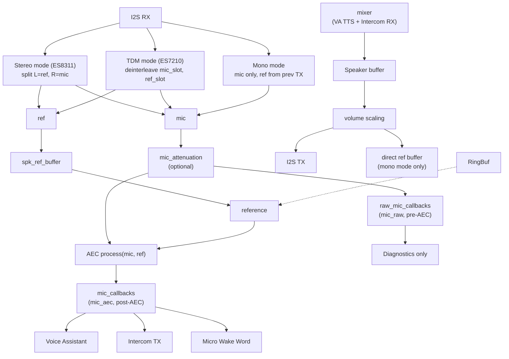

# I2S Audio Duplex - Full-Duplex I2S for ESPHome

True simultaneous microphone and speaker operation on a single I2S bus for audio codecs.

## Why This Component?

Standard ESPHome `i2s_audio` creates separate I2S instances for microphone and speaker, which works for setups with separate I2S buses. However, audio codecs like **ES8311, ES8388, WM8960** use a single I2S bus for both input and output simultaneously.

```
Without i2s_audio_duplex:
  Mic and Speaker fight for I2S bus → Audio glitches, half-duplex only

With i2s_audio_duplex:
  Single I2S controller handles both directions → True full-duplex
```

## Features

- **True Full-Duplex**: Simultaneous mic input and speaker output on one I2S bus
- **Standard Platforms**: Exposes `microphone` and `speaker` platform classes (compatible with Voice Assistant, MWW, intercom_api)
- **Audio Processor Integration**: Built-in audio processing via `esp_aec` (AEC only) or `esp_afe` (AEC + NS + VAD + AGC) components. Both implement the `AudioProcessor` interface and are configured via `processor_id`. Three AEC reference modes:
  - **Direct TX reference** (default): Uses the previous TX frame as AEC reference. No ring buffer, no delay tuning. Works with any setup (discrete MEMS mic + amp, or codec). The AEC adaptive filter compensates for the ~1 chunk latency automatically.
  - **ES8311 Digital Feedback** (recommended for ES8311): Stereo I2S with L=DAC ref, R=ADC mic. Sample-accurate reference. Enable with `use_stereo_aec_reference: true`.
  - **TDM Hardware Reference** (for ES7210 + ES8311): ES7210 in TDM mode captures DAC analog output on a dedicated ADC channel (e.g. MIC3). Sample-aligned with mic data. Enable with `use_tdm_reference: true`.
- **Dual Mic Path**: `pre_aec` option for raw mic (diagnostics) alongside AEC-processed mic (VA/STT/MWW)
- **PSRAM Buffers**: `buffers_in_psram` option moves the non-hot-path audio buffers (AEC mic/ref, processor interleave, multi-channel mic, spk_ref) to PSRAM. `rx_buffer` and `spk_buffer` stay in internal RAM regardless (I2S hot path, PSRAM bus contention would cause glitches). Typical saving: ~15-20KB internal heap. Required for `sr_low_cost` AEC on memory-constrained devices.
- **Volume Controls**: Mic gain (-20 to +30 dB, persistent), mic gain pre-AEC (for weak MEMS mics), speaker volume (persistent)
- **Codec-less Support**: `slot_bit_width: 32` for MEMS mics (INMP441, MSM261, SPH0645) + I2S amp on same bus. `correct_dc_offset: true` for mics without built-in HPF
- **Number Platform**: Native `mic_gain` and `speaker_volume` entities with `ESPPreferenceObject` persistence. When both `i2s_audio_duplex` and `intercom_api` are present, `i2s_audio_duplex` owns the number entities and `intercom_api` defers to avoid conflicts.
- **Cross-Component Validation**: `FINAL_VALIDATE_SCHEMA` prevents dual audio processors (both `i2s_audio_duplex` and `intercom_api` with a processor configured) and dual DC offset removal, catching configuration errors at compile time
- **AEC Gating**: Auto-disables AEC when speaker is silent in mono/stereo modes (prevents filter drift). TDM mode is always-on (hardware ref captures silence naturally).
- **Consumer Registry**: Multiple mic consumers share the I2S bus safely (MWW + VA + intercom). Each consumer registers once at setup via `register_mic_consumer()` and stays registered across internal stop/start cycles (e.g. on a 2-mic → 1-mic reconfigure).
- **CPU-Aware Scheduling**: `taskYIELD()` between frames for MWW inference headroom during AEC
- **Multi-Rate Support**: Run I2S bus at 48kHz for high-quality DAC output while mic/AEC/VA operate at 16kHz via internal FIR decimation
- **Configurable Reference Channel**: Choose left or right stereo channel as AEC reference (supports ES8311, ES8388, and other codecs)

## Architecture



### Task Layout

| Task | Core | Priority | Role |
|------|------|----------|------|
| `i2s_duplex` (audio_task) | **Core 0** | **19** | I2S read/write + FIR decimation + AEC |
| `intercom_tx` | Core 0 | 5 | Mic→network + AEC during intercom calls |
| `intercom_spk` | Core 0 | 4 | Network→speaker, AEC reference feed |
| `intercom_srv` | Core 1 | 5 | TCP RX, call FSM (stays Core 1 for LVGL callback safety) |
| `mixer` (ESPHome) | Any | 10 | Mix VA + intercom audio to speaker |
| `MWW inference` (ESPHome) | Unpinned | 3→**8** | Wake word TFLite inference (boost via on_boot lambda) |
| ESPHome main loop / LVGL | Core 1 | 1 | Switches, sensors, display, etc. |
| WiFi driver (ESP-IDF) | Core 0 | 23 | System; can briefly preempt audio_task |

**Core allocation rationale:**
- **Core 0**: Real-time audio (I2S + AEC). WiFi (prio 23) briefly preempts for sub-ms bursts.
- **Core 1**: MWW inference + mixer + LVGL + ESPHome main loop. MWW priority boosted to 8 (above resampler/loopTask, below mixer) for reliable barge-in during TTS.

**CPU budget** (sr_low_cost: 512 samples @ 16kHz = 32ms per frame):
- Without AEC: ~300us processing (< 2% of a core)
- With SR AEC active: ~22% of Core 0 (vs ~58% with VOIP mode)
- IDLE headroom: Core 0 ~70%, Core 1 ~73% (measured with music + MWW + VA)

## Requirements

- **ESP32**, **ESP32-S3**, or **ESP32-P4** (tested on S3 and P4, including RISC-V dual-core P4 with 32MB PSRAM). Single-core SoCs (C3, C5, C6, H2, S2) supported but cannot pin `task_core` to Core 1.
- AEC requires PSRAM (S3/P4). TDM requires `SOC_I2S_SUPPORTS_TDM` (S3, P4, C3, C5, C6, H2).
- Audio codec with shared I2S bus (ES8311 recommended), or discrete I2S mic + amp on the same bus
- ESP-IDF framework

## Installation

```yaml
external_components:
  - source:
      type: git
      url: https://github.com/n-IA-hane/esphome-intercom
      ref: main
    components: [audio_processor, i2s_audio_duplex, esp_aec]
    # Or with esp_afe (full AFE pipeline: AEC + NS + VAD + AGC):
    # components: [audio_processor, i2s_audio_duplex, esp_afe]
```

## Configuration

### Basic Setup

```yaml
i2s_audio_duplex:
  id: i2s_duplex
  i2s_lrclk_pin: GPIO45      # Word Select (WS/LRCLK)
  i2s_bclk_pin: GPIO9        # Bit Clock (BCK/BCLK)
  i2s_mclk_pin: GPIO16       # Master Clock (optional, some codecs need it)
  i2s_din_pin: GPIO10        # Data In (from codec ADC → ESP mic)
  i2s_dout_pin: GPIO8        # Data Out (from ESP → codec DAC speaker)
  sample_rate: 16000

microphone:
  - platform: i2s_audio_duplex
    id: mic_component
    i2s_audio_duplex_id: i2s_duplex

speaker:
  - platform: i2s_audio_duplex
    id: spk_component
    i2s_audio_duplex_id: i2s_duplex
```

### Configuration Options

| Option | Type | Default | Description |
|--------|------|---------|-------------|
| `id` | ID | Required | Component ID |
| `i2s_lrclk_pin` | pin | Required | Word Select / LR Clock pin |
| `i2s_bclk_pin` | pin | Required | Bit Clock pin |
| `i2s_mclk_pin` | pin | -1 | Master Clock pin (if codec requires) |
| `i2s_din_pin` | pin | -1 | Data input from codec (microphone) |
| `i2s_dout_pin` | pin | -1 | Data output to codec (speaker) |
| `sample_rate` | int | 16000 | I2S bus sample rate (8000-48000) |
| `output_sample_rate` | int | - | Mic/AEC output rate. If set, enables FIR decimation (must divide `sample_rate` evenly, max ratio 6) |
| `processor_id` | ID | - | Reference to audio processor component (`esp_aec` or `esp_afe`) for echo cancellation and audio processing |
| `mic_attenuation` | float | 1.0 | Pre-AEC mic gain/attenuation (0.01-32.0). <1.0 attenuates hot mics, >1.0 amplifies weak mics. Use `mic_gain_pre_aec` number platform for runtime control. |
| `slot_bit_width` | int | auto | I2S slot width in bits (16 or 32). Set to 32 for MEMS mics without codec (INMP441, MSM261, SPH0645). |
| `correct_dc_offset` | bool | false | Enable DC offset removal. Required for MEMS mics without built-in HPF (MSM261, SPH0645). |
| `use_stereo_aec_reference` | bool | false | ES8311 digital feedback mode (see below) |
| `reference_channel` | string | left | Which stereo channel carries AEC reference: `left` or `right` |
| `use_tdm_reference` | bool | false | TDM hardware reference mode (ES7210, see below) |
| `tdm_total_slots` | int | 4 | Number of TDM slots (2-8) |
| `tdm_mic_slot` | int | 0 | TDM slot index for voice microphone |
| `tdm_ref_slot` | int | 1 | TDM slot index for AEC reference (e.g. MIC3 capturing DAC output) |
| `task_priority` | int | 19 | FreeRTOS priority of the audio task (1-24). Default 19 is above lwIP (18), below WiFi (23). |
| `task_core` | int | 0 | Core affinity: 0 or 1 for pinned, -1 for unpinned. Default 0 follows Espressif AEC pattern. |
| `task_stack_size` | int | 8192 | Audio task stack size in bytes (4096-32768). Increase if you see stack overflow warnings. |
| `buffers_in_psram` | bool | false | Move non-hot-path audio buffers (AEC mic/ref, processor interleave, multi-channel mic, spk_ref) to PSRAM. `rx_buffer`/`spk_buffer` always stay in internal RAM. Saves ~15-20KB internal heap. Required for `sr_low_cost` AEC mode (512-sample frames). |
| `audio_stack_in_psram` | bool | false | Place the audio task's own stack in PSRAM. Saves ~8KB of DMA-capable internal RAM at the cost of ~3x slower function return paths. Only enable on boards that need the internal headroom (e.g. waveshare-s3 running 2-mic BSS plus concurrent TLS streams from `speaker_media_player` and intercom). The audio task is not CPU-bound (heavy esp-sr work runs in `esp_afe`'s feed task on core 1), so PSRAM stack latency is acceptable here. Requires `CONFIG_SPIRAM_ALLOW_STACK_EXTERNAL_MEMORY=y` (already default on our YAMLs). Leave it `false` on any board that does not hit the "not enough internal RAM" boundary; normal lifecycle is identical to the non-opt-in path. |
| `aec_reference` | string | `previous_frame` | Mono-mode AEC reference source. `previous_frame` (default) reuses the prior TX frame for echo reference, no buffering, no delay tuning. `ring_buffer` stores TX in a TYPE2-style ring with configurable capacity for better frame alignment on no-codec setups. Ignored when `use_stereo_aec_reference` or `use_tdm_reference` is true. |
| `aec_reference_buffer_ms` | int | 80 | Capacity of the AEC reference ring buffer in milliseconds (32 to 500). Only used with `aec_reference: ring_buffer`. Larger values absorb more producer/consumer jitter at the cost of latency. |

### Microphone Options

| Option | Type | Default | Description |
|--------|------|---------|-------------|
| `pre_aec` | bool | false | If true, receives raw mic audio (before AEC). Mainly for diagnostics; with `sr_low_cost` AEC, MWW works on post-AEC mic. |

### AEC with Voice Assistant + MWW

Use `sr_low_cost` AEC mode for simultaneous VA + MWW. This is critical: VOIP modes add a residual echo suppressor (RES) that distorts spectral features MWW relies on (confirmed: VOIP = 2/10 detection, SR = 10/10). Espressif engineer (esp-sr #159): *"For speech recognition and wake word models, adding the non-linear module reduces recognition accuracy."*

```yaml
esp_aec:
  id: aec_component
  sample_rate: 16000
  filter_length: 4        # 64ms tail (4 for integrated codec, 8 for separate mic+speaker)
  mode: sr_low_cost       # Linear-only AEC, preserves spectral features for MWW

i2s_audio_duplex:
  id: i2s_duplex
  # ... pins ...
  processor_id: aec_component   # or esp_afe component
  buffers_in_psram: true  # Required for sr_low_cost (512-sample frames need more memory)

microphone:
  - platform: i2s_audio_duplex
    id: mic_aec
    i2s_audio_duplex_id: i2s_duplex

  # Pre-AEC: raw mic (diagnostics only)
  - platform: i2s_audio_duplex
    id: mic_raw
    i2s_audio_duplex_id: i2s_duplex
    pre_aec: true

micro_wake_word:
  microphone: mic_aec     # Post-AEC works with SR linear AEC

voice_assistant:
  microphone: mic_aec
```

With SR linear AEC, MWW detects reliably on post-AEC audio even during TTS playback. No need for a separate `mic_raw` path. MWW task priority can be boosted from default 3 to 8 via `on_boot` lambda for reliable barge-in.

### AEC Mode Comparison

| Mode | Engine | CPU (Core 0) | RES | MWW compatible |
|------|--------|-------------|-----|----------------|
| `sr_low_cost` | `esp_aec3_728` (linear, SIMD) | **~22%** | No | **Yes** (10/10) |
| `sr_high_perf` | `esp_aec3_hps16fft` (linear, FFT) | ~25% | No | Yes |
| `voip_low_cost` | `dios_ssp_aec` (Speex-based) | **~58%** | Yes (always) | **No** (2/10) |
| `voip_high_perf` | `dios_ssp_aec` | ~64% | Yes (always) | No |

SR modes use `esp_aec3` (pure linear adaptive filter, no non-linear processing). VOIP modes use `dios_ssp_aec` (linear + two-stage RES). Use `sr_low_cost` for VA + MWW + intercom. Do not use `sr_high_perf` on ESP32-S3 (exhausts DMA memory).

### ES8311 Digital Feedback AEC (Recommended)

For **ES8311 codec**, enable `use_stereo_aec_reference` for **perfect echo cancellation**:

```yaml
i2s_audio_duplex:
  id: i2s_duplex
  # ... pins ...
  processor_id: aec_component
  use_stereo_aec_reference: true  # ES8311 digital feedback
```

**How it works:**
- ES8311 register 0x44 is configured to output DAC+ADC on ASDOUT as stereo
- L channel = DAC loopback (reference signal), R channel = ADC (microphone), configurable via `reference_channel`
- Reference is **sample-accurate** (same I2S frame as mic) → best possible AEC
- The reference comes directly from the I2S RX deinterleave, sample-accurate

### TDM Hardware Reference (ES7210 + ES8311)

For boards with **ES7210** (multi-channel ADC) + **ES8311** (DAC), such as the Waveshare ESP32-S3-AUDIO-Board, the ES7210 can capture the ES8311 DAC analog output on a dedicated ADC channel. This provides a sample-aligned AEC reference without needing the ES8311 digital feedback mode.

```yaml
i2s_audio_duplex:
  id: i2s_duplex
  # ... pins ...
  processor_id: aec_component
  use_tdm_reference: true
  tdm_total_slots: 4       # ES7210 4-slot TDM
  tdm_mic_slot: 0           # Slot 0 = MIC1 (voice)
  tdm_ref_slot: 1           # Slot 1 = MIC3 (DAC feedback via analog loopback)
```

**How it works:**
- ES7210 operates in TDM mode with 4 interleaved slots per I2S frame
- MIC1 (slot 0) captures voice, MIC3 (slot 1) captures the ES8311 analog output
- I2S is configured as `I2S_SLOT_MODE_STEREO` with TDM slot mask so all slots appear in DMA
- The audio task deinterleaves mic and ref from the TDM frame; they are inherently sample-aligned
- The hardware ref is naturally silent when speaker is silent
- The analog reference already reflects DAC hardware volume

**ES7210 TDM register configuration** (required in `on_boot` lambda):
```yaml
esphome:
  on_boot:
    priority: 200
    then:
      - lambda: |-
          // Enable ES7210 TDM mode + MIC3 for AEC reference
          uint8_t data[2];
          // Clock enable: clear bits [5:0] to enable all clocks
          data[0] = 0x01; data[1] = 0x00;
          id(i2c_bus).write(0x40, data, 2);
          // TDM mode enable
          data[0] = 0x12; data[1] = 0x02;
          id(i2c_bus).write(0x40, data, 2);
          // MIC3 gain 30dB (Espressif Korvo-2 reference: GAIN_30DB for AEC ref)
          // DAC→MIC3 path has 2.2K series + filter (~1.7dB attenuation), needs gain.
          data[0] = 0x45; data[1] = 0x1A;
          id(i2c_bus).write(0x40, data, 2);
```

> **Note**: `use_tdm_reference` and `use_stereo_aec_reference` are mutually exclusive. TDM mode uses `I2S_SLOT_MODE_STEREO` for the I2S channel (required to get all TDM slots in DMA).

### Multi-Rate: 48kHz I2S Bus with FIR Decimation

Many audio codecs (ES8311, ES7210, WM8960) operate **natively at 48kHz**. Running the I2S bus at 16kHz forces the codec's internal PLL to generate a non-standard clock, which often results in audible artifacts, worse SNR, and suboptimal DAC/ADC performance. At 48kHz the codec produces noticeably cleaner audio: lower noise floor, better high-frequency response for TTS and media playback.

The challenge: AEC (ESP-SR), Micro Wake Word (TFLite Micro), Voice Assistant STT, and intercom all require **16kHz** input. The solution is to run the I2S bus at 48kHz and internally decimate the mic path to 16kHz using a FIR anti-alias filter.

#### Signal Flow

```
                    ┌─── Speaker path ──────────────────────────────→ I2S TX (48kHz)
                    │    (native rate, no resampling)
I2S bus: 48kHz ─────┤
                    │    ┌─ FIR decimate ×3 ─┐
                    └─── Mic path (48kHz) ───┘──→ 16kHz ──→ AEC / MWW / VA / intercom
```

The FIR decimator uses a **31-tap lowpass filter** (Kaiser window β=8.0, cutoff 7.5kHz, ~35dB stopband attenuation (adequate for speech)) implemented in **float32** on the ESP32-S3 hardware FPU. It is applied separately to the mic channel and the AEC reference channel. CPU overhead at ratio=3 is approximately **0.5% of Core 0** per frame, which is negligible.

If `output_sample_rate` is omitted the decimation ratio is 1 and the FIR code is **completely bypassed**: zero overhead, fully backward compatible.

| Parameter | Value |
|-----------|-------|
| FIR taps | 31 |
| Window | Kaiser β=8.0 |
| Cutoff | 7.5kHz (below Nyquist @ 16kHz) |
| Stopband attenuation | ~60dB |
| Arithmetic | float32 (hardware FPU) |
| Supported ratios | 2, 3, 4, 5, 6 |
| CPU overhead (ratio=3) | ~0.5% of Core 0 per frame |
| Memory per decimator | 31 × 4 = 124 bytes delay line |

#### i2s_audio_duplex Config

```yaml
i2s_audio_duplex:
  id: i2s_duplex
  # ... pins ...
  sample_rate: 48000           # I2S bus rate (ES8311/ES7210 native, best DAC quality)
  output_sample_rate: 16000    # Mic/AEC/MWW/VA decimated to 16kHz via FIR filter
  processor_id: aec_component
  use_stereo_aec_reference: true    # Reference from I2S RX stereo deinterleave (no delay needed)

esp_aec:
  id: aec_component
  sample_rate: 16000           # AEC always operates on 16kHz audio
  filter_length: 4
  mode: sr_low_cost      # Linear AEC, preserves spectral features for MWW
```

#### Speaker Path: ResamplerSpeaker + Mixer

Since the I2S bus runs at 48kHz the speaker must also receive 48kHz audio. ESPHome's `resampler` speaker platform transparently converts any input rate to the target rate:

```yaml
speaker:
  # Hardware output: writes 48kHz PCM to the I2S bus
  - platform: i2s_audio_duplex
    id: hw_speaker
    i2s_audio_duplex_id: i2s_duplex

  # Mixer combines VA TTS and intercom at 48kHz
  - platform: mixer
    id: audio_mixer
    output_speaker: hw_speaker
    num_channels: 1
    source_speakers:
      - id: va_speaker_mix
        timeout: 10s
      - id: intercom_speaker_mix
        timeout: 10s

  # ResamplerSpeakers: convert any input rate → 48kHz before the mixer
  - platform: resampler
    id: va_speaker               # VA TTS and media player output here
    output_speaker: va_speaker_mix

  - platform: resampler
    id: intercom_speaker         # 16kHz intercom RX upsampled → 48kHz
    output_speaker: intercom_speaker_mix
```

The `resampler` platform uses polyphase interpolation. For 16kHz→48kHz with default settings (`filters: 16, taps: 16`), CPU overhead on ESP32-S3 is approximately 2% of Core 1 during playback. If you see `[W] component took a long time` warnings for `resampler.speaker` you can try `filters: 8, taps: 8` to reduce CPU at a minimal quality cost, or `filters: 4, taps: 4` for minimal CPU.

#### How Home Assistant Knows to Send 48kHz

HA reads the `sample_rate` from the `announcement_pipeline` in the `media_player` config and transcodes audio accordingly via `ffmpeg_proxy`:

```yaml
media_player:
  - platform: speaker
    announcement_pipeline:
      speaker: va_speaker        # Points to the resampler speaker
      format: FLAC
      sample_rate: 48000         # HA will transcode TTS and media to FLAC 48kHz
      num_channels: 1
```

For TTS, HA requests the TTS engine at 48kHz directly. For radio/media streams, `ffmpeg_proxy` transcodes the source to FLAC 48kHz before sending it to the device. In both cases audio arrives at the ESP at 48kHz and goes to the speaker without any intermediate downsampling.

**Configure ES8311 register in on_boot:**
```yaml
esphome:
  on_boot:
    - lambda: |-
        uint8_t data[2] = {0x44, 0x48};  // ADCDAT_SEL = DACL+ADC (stereo AEC ref)
        id(i2c_bus).write(0x18, data, 2);
```

> **Note**: Without `use_stereo_aec_reference`, the component uses a direct reference from the previous TX frame. Stereo mode is sample-accurate and recommended for ES8311.

## Pin Mapping by Codec

### ES8311 (Xiaozhi Ball V3, AI Voice Kits)
```yaml
i2s_audio_duplex:
  i2s_lrclk_pin: GPIO45   # LRCK
  i2s_bclk_pin: GPIO9     # SCLK
  i2s_mclk_pin: GPIO16    # MCLK (required)
  i2s_din_pin: GPIO10     # SDOUT (codec → ESP)
  i2s_dout_pin: GPIO8     # SDIN (ESP → codec)
  sample_rate: 48000             # ES8311 native rate (better DAC quality)
  output_sample_rate: 16000      # Mic/AEC/MWW/VA at 16kHz (FIR decimation ×3)
  use_stereo_aec_reference: true # Digital feedback (recommended)
```

### ES8311 + ES7210 TDM (Waveshare ESP32-S3-AUDIO-Board)
```yaml
i2s_audio_duplex:
  i2s_lrclk_pin: GPIO14   # LRCK (shared bus)
  i2s_bclk_pin: GPIO13    # SCLK
  i2s_mclk_pin: GPIO12    # MCLK (required)
  i2s_din_pin: GPIO15     # ES7210 SDOUT (codec → ESP)
  i2s_dout_pin: GPIO16    # ES8311 SDIN (ESP → codec)
  sample_rate: 16000
  use_tdm_reference: true
  tdm_total_slots: 4
  tdm_mic_slot: 0          # MIC1 = voice
  tdm_ref_slot: 1          # MIC3 = DAC analog feedback
```

### ES8388 (LyraT, Audio Dev Boards)
```yaml
i2s_audio_duplex:
  i2s_lrclk_pin: GPIO25   # LRCK
  i2s_bclk_pin: GPIO5     # SCLK
  i2s_mclk_pin: GPIO0     # MCLK (required)
  i2s_din_pin: GPIO35     # DOUT
  i2s_dout_pin: GPIO26    # DIN
  sample_rate: 16000
```

### WM8960 (Various Dev Boards)
```yaml
i2s_audio_duplex:
  i2s_lrclk_pin: GPIO4    # LRCLK
  i2s_bclk_pin: GPIO5     # BCLK
  i2s_mclk_pin: GPIO0     # MCLK (required)
  i2s_din_pin: GPIO35     # ADCDAT
  i2s_dout_pin: GPIO25    # DACDAT
  sample_rate: 16000
```

## When to Use This vs Standard i2s_audio

| Scenario | Use This Component | Use Standard i2s_audio |
|----------|-------------------|----------------------|
| ES8311/ES8388/WM8960 codec | Yes | No (won't work properly) |
| INMP441 + MAX98357A on same bus | Yes (direct TX reference, `slot_bit_width: 32`) | No |
| INMP441 + MAX98357A on separate buses | Either works | Yes |
| PDM microphone + I2S speaker | No | Yes (different protocols) |
| Need true full-duplex on single bus | Yes | Limited |
| VA + MWW + Intercom on same device | Yes (single bus) | Yes (dual bus with mixer speaker) |

## GPIO Mode Switching (VA + Intercom)

When combining Voice Assistant and Intercom on the same device, a single GPIO button can handle all actions using page-aware logic:

```yaml
binary_sensor:
  - platform: gpio
    pin:
      number: GPIO0
      inverted: true
    id: main_button
    on_click:
      - min_length: 0ms
        max_length: 500ms
        then:
          # Single click: action depends on current page
          - if:
              condition:
                # Timer ringing → stop timer (highest priority, any page)
                lambda: 'return id(voice_assist_phase) == 20;'
              then:
                - voice_assistant.stop:
          - if:
              condition:
                lvgl.page.is_showing: ic_idle_page
              then:
                - intercom_api.call_toggle:
                    id: intercom
          - if:
              condition:
                lvgl.page.is_showing: ic_ringing_in_page
              then:
                - intercom_api.answer_call:
                    id: intercom
          - if:
              condition:
                or:
                  - lvgl.page.is_showing: ic_ringing_out_page
                  - lvgl.page.is_showing: ic_in_call_page
              then:
                - intercom_api.call_toggle:
                    id: intercom
          # VA pages: start/stop voice assistant (default)
      - min_length: 500ms
        max_length: 1000ms
        then:
          # Double click: next contact (IC idle) or decline (IC ringing)
          - if:
              condition:
                lvgl.page.is_showing: ic_idle_page
              then:
                - intercom_api.next_contact:
                    id: intercom
          - if:
              condition:
                lvgl.page.is_showing: ic_ringing_in_page
              then:
                - intercom_api.decline_call:
                    id: intercom
    on_multi_click:
      - timing:
          - ON for at least 1s
        then:
          # Long press: switch between VA and Intercom modes
```

### Button Behavior Summary

| Current Page | Single Click | Double Click | Long Press |
|---|---|---|---|
| VA idle | Start voice assistant | n/a | Switch to intercom |
| VA active | Stop voice assistant | n/a | n/a |
| IC idle | Call selected contact | Next contact | Switch to VA |
| IC ringing in | Answer call | Decline call | Switch to VA |
| IC ringing out | Hangup | n/a | Switch to VA |
| IC in call | Hangup | n/a | Switch to VA |
| Timer ringing | Stop timer (any page) | n/a | n/a |

> **Note**: Wake word detection is ALWAYS active regardless of the current mode. Mode switching only affects the display and button behavior.

## Technical Notes

- **Sample Format**: 16-bit signed PCM, mono TX / stereo RX (ES8311 feedback mode)
- **DMA Buffers**: 8 buffers x 512 frames for smooth streaming (~256ms total)
- **Speaker Buffer**: 8192 bytes ring buffer (~256ms at 16kHz mono), scales with decimation ratio (24576 bytes at 48kHz)
- **Task Priority**: 19 (above lwIP at 18, below WiFi at 23). Configurable via `task_priority` YAML option.
- **Core Affinity**: Pinned to Core 0 (canonical Espressif AEC pattern; frees Core 1 for MWW inference and LVGL). Configurable via `task_core` YAML option.
- **AEC Gating**: Mono/stereo modes process AEC only when speaker had real audio within last 250ms. TDM mode is always-on (hardware ref captures silence naturally, no filter drift).
- **Thread Safety**: All cross-thread variables use `std::atomic` with `memory_order_relaxed`, including `float` volumes (`mic_gain_`, `mic_attenuation_`, `speaker_volume_`). A **snapshot pattern** loads all atomics once per 16ms frame into local `AudioTaskCtx` fields, avoiding repeated `.load()` in sample loops. Ring buffer resets use atomic request flags (`request_speaker_reset_`) to avoid concurrent access between main thread and audio task.
- **Task Structure**: `audio_task_()` is split into `process_rx_path_()`, `process_aec_and_callbacks_()`, and `process_tx_path_()`, sharing state via `AudioTaskCtx` struct. AEC buffers use 16-byte aligned allocation for ESP-SR SIMD safety.
- **Mic Gain**: -20 to +30 dB range (applied post-AEC in audio_task). Stored via `ESPPreferenceObject` and restored on boot. Mic gain is applied to post-AEC output (affects VA/intercom/MWW equally).
- **Cross-Component Validation**: `FINAL_VALIDATE_SCHEMA` checks at compile time that `i2s_audio_duplex` and `intercom_api` don't both configure an audio processor (`processor_id`) or DC offset removal. If both components are present, `i2s_audio_duplex` takes ownership of audio processing and DC offset; `intercom_api` should NOT set `processor_id` or `dc_offset_removal`.

### Audio task lifecycle

The audio task is an internal FreeRTOS task with three properties worth knowing about, all stable since the audio-core-v2 audit:

- **Lazy creation**. The task is created on the first `i2s_audio_duplex.start` call, not at component setup. Boards that never start the audio path (rare) save ~8 KB of RAM at boot.
- **Permanent**. Once created, the task lives for the rest of the device's uptime. `i2s_audio_duplex.stop` flips an internal `duplex_running_` flag and stops the I²S peripheral, but does not destroy the task. A subsequent `start` reuses the same TCB and stack.
- **In-place reconfigure**. When the linked processor's `frame_spec` changes (typical example: `esp_afe` SE toggle flipping `mic_channels` between 1 and 2), the audio task observes the `frame_spec_revision()` bump at the top of its main loop and reinitialises decimator, reference extraction and output buffers in place. Worst-case-sized buffers are pre-allocated once at first start, so the reconfigure path does not call `heap_caps_alloc` and cannot fragment SPIRAM.

This is why mic consumers (MWW, Voice Assistant, intercom) survive an internal stop/start cycle: the task and its consumer registry are intact across reconfigure.

### Mic consumer registry (C++ API)

Components that want to receive processed mic frames register themselves once at setup with an opaque token:

```cpp
i2s_audio_duplex_->register_mic_consumer(this);   // typically `this` of the consumer component
// ... runs forever ...
i2s_audio_duplex_->unregister_mic_consumer(this); // optional, only if the consumer is destroyed
```

The token is just an identity; the registry tracks live consumers in a `std::vector<void*>` and gates the mic capture (no consumers means no callbacks fired). The registry survives `stop()` and internal reconfigure cycles, so consumers do not need to re-register. Replaces the older `mic_ref_count_` atomic refcount, which lost its count on `stop()` and silently disconnected MWW / VA after every internal reconfigure.

### Mono-mode AEC reference

When neither `use_stereo_aec_reference` nor `use_tdm_reference` is enabled, the AEC reference comes from the speaker output. Two options via `aec_reference:`:

- **`previous_frame`** (default): the audio task uses the prior 32 ms TX frame as the AEC reference. Simple, works on any hardware, AEC adapts to the constant 32 ms latency.
- **`ring_buffer`**: speaker TX is stored in a TYPE2-style ring buffer with `aec_reference_buffer_ms` of capacity. The mono-reference helper reads from the ring; on starvation it zero-fills (the AEC handles that as a "no echo this frame") rather than reusing stale data. Better frame alignment on no-codec setups (discrete MEMS mic + I²S amp) at the cost of `aec_reference_buffer_ms` of latency.

### PSRAM and sdkconfig Requirements

For reliable audio on PSRAM-based devices, these sdkconfig options are **critical** and are NOT defaults:

**ESP32-S3:**
```yaml
sdkconfig_options:
  CONFIG_ESP32S3_DATA_CACHE_64KB: "y"       # Default is 32KB, too small for audio+PSRAM
  CONFIG_ESP32S3_DATA_CACHE_LINE_64B: "y"   # Default is 32B; 64B reduces cache misses
  CONFIG_SPIRAM_FETCH_INSTRUCTIONS: "y"     # Move code to PSRAM, frees internal SRAM
  CONFIG_SPIRAM_RODATA: "y"                 # Move read-only data to PSRAM
  CONFIG_MBEDTLS_EXTERNAL_MEM_ALLOC: "y"    # TLS buffers in PSRAM (saves ~40KB internal)
```

**ESP32-P4:**
```yaml
sdkconfig_options:
  CONFIG_CACHE_L2_CACHE_256KB: "y"          # Default is 128KB; 256KB for MIPI DSI+audio+LVGL
  CONFIG_SPIRAM_FETCH_INSTRUCTIONS: "y"
  CONFIG_SPIRAM_RODATA: "y"
  CONFIG_ESP_TASK_WDT_TIMEOUT_S: "30"       # esp32_hosted + MIPI can block main loop
  CONFIG_MBEDTLS_EXTERNAL_MEM_ALLOC: "y"
```

Removing any of these causes audio glitch at stream startup (cache cold-start: every PSRAM access is a miss until the working set loads, ~1 second).

## Troubleshooting

### No Audio Output
1. Check MCLK connection (many codecs require it)
2. Verify codec I2C initialization (check logs)
3. Ensure speaker amp is enabled (GPIO control if applicable)

### Audio Crackling
1. Reduce sample_rate (try 8000 or 16000)
2. Check for WiFi interference (pin to Core 1)
3. Verify PSRAM is available if using AEC

### Echo During Calls
1. Enable AEC: set `processor_id` on `i2s_audio_duplex`
2. For ES8311: enable `use_stereo_aec_reference: true` + configure register 0x44
3. Adjust `filter_length` (4 for integrated codec, 8 for separate speaker)

### TDM Mode: Audio Corruption (Whistle/Machine Gun Noise)
1. Ensure I2S uses `I2S_SLOT_MODE_STEREO` (not MONO) for TDM. MONO only puts slot 0 in DMA
2. Check ES7210 TDM register initialization (reg 0x12 = 0x02 for TDM mode)
3. Verify `tdm_total_slots` matches the actual ES7210 slot count
4. Check DMA buffer size: at 4 slots, `dma_frame_num` should be 256 (2048 bytes/descriptor, under 4092 limit)

### MWW Not Detecting During TTS
1. **Use `sr_low_cost` AEC mode** (not VOIP). See [AEC Mode Comparison](#aec-mode-comparison).
2. **MWW on `mic_aec`** (post-AEC), NOT `mic_raw`.
3. **Enable `buffers_in_psram: true`** for SR mode's 512-sample frames on ESP32-S3.
4. **Boost MWW priority to 8** via on_boot lambda (ESPHome defaults to 3, below mixer at 10).
5. Do NOT use `sr_high_perf` on ESP32-S3 (exhausts DMA memory).

### Switches/Display Slow With AEC On
With `i2s_duplex` on **Core 0**, AEC no longer competes with LVGL/display on Core 1. This issue is resolved by correct core assignment. If you still see display slowness, check that no other high-priority task is pinned to Core 1.

### SPI Errors (err 101) With AEC
1. Use `mode: sr_low_cost` or `mode: voip_low_cost`. `sr_high_perf` exhausts DMA memory on ESP32-S3
2. Enable `buffers_in_psram: true` to free internal heap
3. Reduce display update interval (500ms+) to avoid SPI bus contention
4. Check free heap in logs after boot

## Known Limitations

- **Media files should match bus sample rate**: For best quality, use media files at the bus `sample_rate` (e.g. 48kHz). The `resampler` speaker handles conversion from any rate, but native rate avoids resampling artifacts.
- **loopTask long-operation warnings during 48kHz streaming**: ESPHome reports `[W] mixer.speaker took a long time (110ms)` and similar warnings for `resampler.speaker`, `api`, `wifi` during audio playback. This is **expected and harmless**. These components run in loopTask (Core 1, prio 1) and process audio/network chunks that take >30ms. All real-time audio runs in dedicated tasks on Core 0 and is unaffected.
- **AEC is ESP-SR closed-source**: Cannot reset the adaptive filter without recreating the handle. Gating (timeout-based bypass when speaker has been silent for >250ms) is the workaround.
- **TDM analog reference vs ES8311 digital feedback**: The digital feedback path (ES8311 stereo loopback) provides a cleaner reference signal for AEC than the TDM analog path (ES7210 MIC3 capturing speaker output). Analog loopback introduces non-linear distortion from the DAC/amplifier chain that the AEC linear adaptive filter cannot fully model. Expect ~95-98% echo cancellation with analog reference vs ~99% with digital feedback. Both are adequate for voice assistant and intercom use.
- **AEC reference**: The reference signal is always the exact post-volume PCM sent to the speaker, with no additional scaling. For hardware codec setups (ES8311, TDM), the reference naturally includes hardware volume. For software reference (no codec), the reference includes software volume. `mic_gain_pre_aec` is applied only to the mic signal, not the reference.

## License

MIT License
